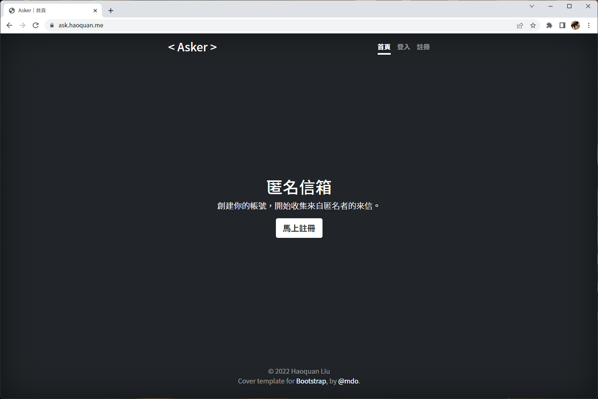

# Asker
English | [繁體中文](docs/README_zh-tw.md)
## About The Project

此專案為匿名信箱基本架構，有註冊、登入、設定⋯⋯等基本功能，主要由 jQuery AJAX、PHP 和 MySQL Database 構成。
## Project Structure
```
Asker/
├── js/
│   ├── login.js
│   ├── register.js
│   ├── setting.js
│   ├── receive.js
│   └── user.js
├── php/
│   ├── config.php
│   └── main.php
├── index.php
├── login.php
├── register.php
├── setting.php
├── receive.php
└── user.php
```
